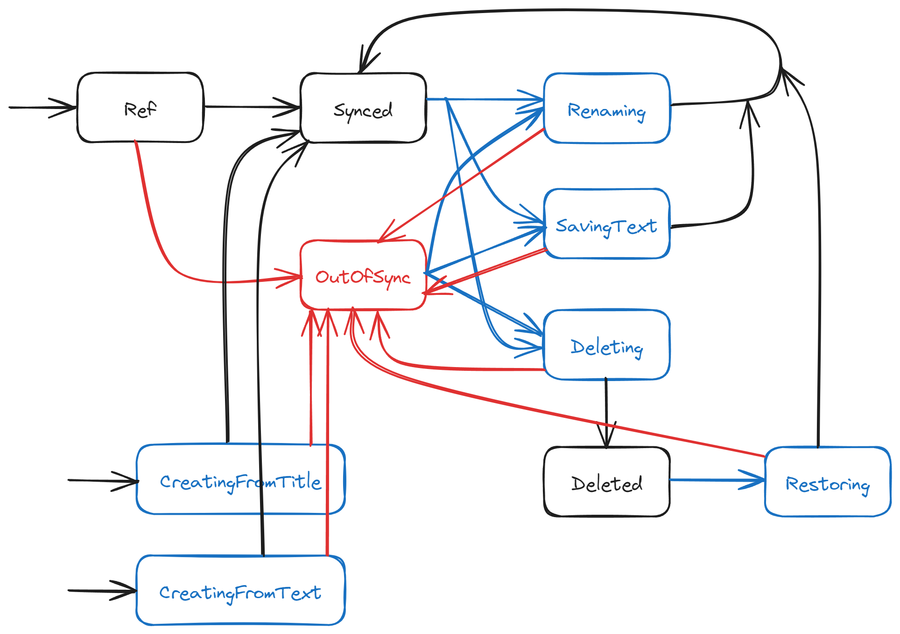

## NotedOK

### Disclaimer

_This is a port of a project (https://notedok.com/) I started back in 2013, so some code is pretty old and just moved as is. The part related to UI rendering, logic and event handling is completely reworked to align with my own proposed experimental [guidelines](https://github.com/artemkv/frontend_guidelines)._

### Note state transition diagram



### Most important project files

- `src\model.ts` contains the boxes, i.e. types for each of the note states. _All the types are treated as immutable_
- `src\noteLifecycle.ts` contains the arrows, i.e. all the valid state transitions. _All the functions here are pure_
- `src\events.ts` contains the full list of events that are generated by components/commands. _All the types are treated as immutable_
- `src\commands.ts` contains all the commands that can be issued. _All the types are treated as immutable_
- `src\reducer.ts` handles all the events by delegating actual execution to `src\business.ts`. _All the functions here are pure_
- `src\business.ts` is the one fully covered by unit-tests (`src\business.tests.ts`). All the interesting things are happening there
- Side effects (such as generating random unique note titles) are only allowed in commands (meaning: actual implementations of commands, for example, `src\commands\storage.ts`)
- All the components are [almost] pure and don't manage their own state, except the `src\components\SearchPanel.tsx`, where the state is managed locally, as an on-going experiment
- There is also some impurity due integration with a legacy autocomplete library (no time to tackle it now). Some components force focus upon first render etc.
- Most of the components, however, treated as pure and are wrapped in `memo`
- The state is managed using custom-made `src\hooks\useReducer.ts` hook. The reason to use custom hook is that I like the Elm model where reducer spits out new state and command, and the existing `useReducer` only returns the new state. I don't like thunks and stuff like that
- The app state lives in `src\AppStatefulContainer.tsx`, the uppermost component

## Running the app

Development

```
npm run dev
```

Prod build:

```
npm run build
```

## TODO: (this comes from Vite template) Expanding the ESLint configuration

If you are developing a production application, we recommend updating the configuration to enable type aware lint rules:

- Configure the top-level `parserOptions` property like this:

```js
export default tseslint.config({
  languageOptions: {
    // other options...
    parserOptions: {
      project: ["./tsconfig.node.json", "./tsconfig.app.json"],
      tsconfigRootDir: import.meta.dirname,
    },
  },
});
```

- Replace `tseslint.configs.recommended` to `tseslint.configs.recommendedTypeChecked` or `tseslint.configs.strictTypeChecked`
- Optionally add `...tseslint.configs.stylisticTypeChecked`
- Install [eslint-plugin-react](https://github.com/jsx-eslint/eslint-plugin-react) and update the config:

```js
// eslint.config.js
import react from "eslint-plugin-react";

export default tseslint.config({
  // Set the react version
  settings: { react: { version: "18.3" } },
  plugins: {
    // Add the react plugin
    react,
  },
  rules: {
    // other rules...
    // Enable its recommended rules
    ...react.configs.recommended.rules,
    ...react.configs["jsx-runtime"].rules,
  },
});
```
